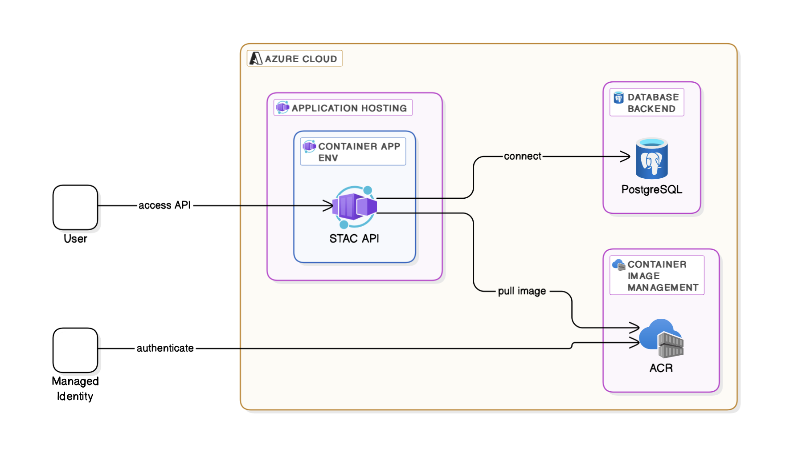

# Simple STAC API Deployment on Azure

This repository provides scripts to deploy a STAC API on Azure.



## Overview

The goal of this project is to create a relatively **simpler, single-container deployment** of a STAC API suitable for running on Azure services like Azure Container Apps (ACA).

This deployment utilizes the **`stac-fastapi-pgstac`** backend. This specific backend combines `stac-fastapi`, a Python framework for building STAC APIs, with `PgSTAC`, which manages STAC data within a PostgreSQL database.

> **STAC (SpatioTemporal Asset Catalog)** is a specification designed to standardize the way geospatial assets (like satellite imagery, drone captures, etc.) are described and cataloged online. This standardization makes it much easier to search, discover, and work with these assets across different providers and tools.

## Key Components Explained

To understand this deployment, it's helpful to know what the core pieces do:

* **STAC API:** While STAC defines the *format* for metadata, the **STAC API** specification defines *how* users and software interact with a STAC catalog over the web (HTTP). It standardizes endpoints for searching items (by location, time, metadata properties), browsing collections, and retrieving specific item or collection details. Essentially, a STAC API server is the **web service** that makes a STAC catalog accessible and queryable online according to these standards. This project deploys such a server.

* **PgSTAC:** PgSTAC is a specialized **PostgreSQL database schema and set of functions** specifically designed to efficiently store and query STAC metadata. It leverages the power of PostgreSQL and its PostGIS extension (for geospatial capabilities) to provide a robust and performant backend for STAC data. PgSTAC handles the **data storage and querying logic** within the database itself. It is *not* the web API, but the engine that manages the STAC Items and Collections data persisted in the database. The `setup_db.sh` script in this project is responsible for configuring a PostgreSQL database instance and setting up PgSTAC within it.

* **`stac-fastapi`:** This is a **Python library** built using the modern, high-performance **FastAPI** web framework. It provides the core implementation for building STAC API servers. It translates incoming web requests (like searches) into actions performed against a backend data source and formats the responses according to the STAC API specification. `stac-fastapi` is designed to be modular and supports different backends. In this project, we use the **`stac-fastapi-pgstac`** implementation, which specifically connects the `stac-fastapi` framework to a PgSTAC database, acting as the **web application layer** that sits between the user and the PgSTAC database. The `setup_app.sh` script likely builds and deploys the container running this `stac-fastapi` application.

In summary: `stac-fastapi` provides the web server application adhering to the STAC API standard, while `PgSTAC` manages the STAC data efficiently within a PostgreSQL database. This project bundles them for deployment on Azure.

**Status:** Please note that this work is currently **in progress**. While functional, it may evolve. To the best of my knowledge, this setup represents one of the simplest, bare-bones methods for deploying a `stac-fastapi-pgstac` based STAC API on Azure.

## How to Use:

**1. Ensure Files Exist**: Make sure you have the previously generated (or manually created) `setup_db.sh` and `setup_app.sh` files in the same directory as `run_deployment.sh`.

**2. Configure**: Crucially, edit `setup_db.sh` and `setup_app.sh` to replace all placeholder values (like `<your-resource-group>`, `<your-acr-name>`, `<your_db_password>`, etc.) with your actual Azure configuration details.

**3. Save**: Save the deployment script code into a file named `run_deployment.sh` in that same directory.

**4. Make Executable**: Open your terminal in that directory and make all three scripts executable:
   ```bash
   chmod +x setup_db.sh
   chmod +x setup_app.sh
   chmod +x run_deployment.sh
   ```

**5. Run** : Execute the main script:
```bash
./run_deployment.sh
```
This script will first run `./setup_db.sh`. If it completes successfully, it will then proceed to run `./setup_app.sh`. If either script encounters an error (and exits because of `set -e`), the `run_deployment.sh` script will stop execution immediately.